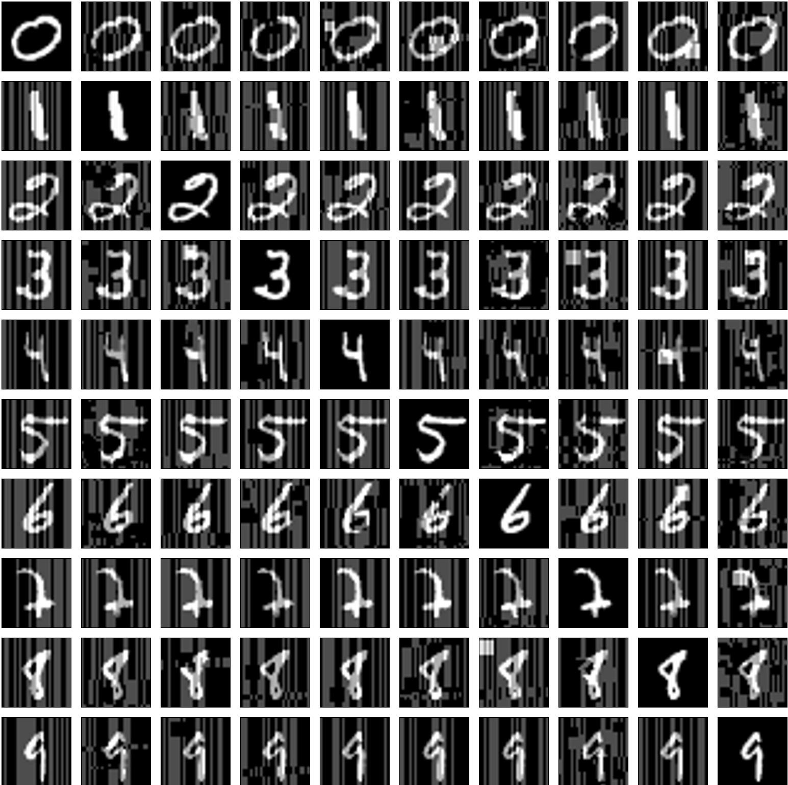
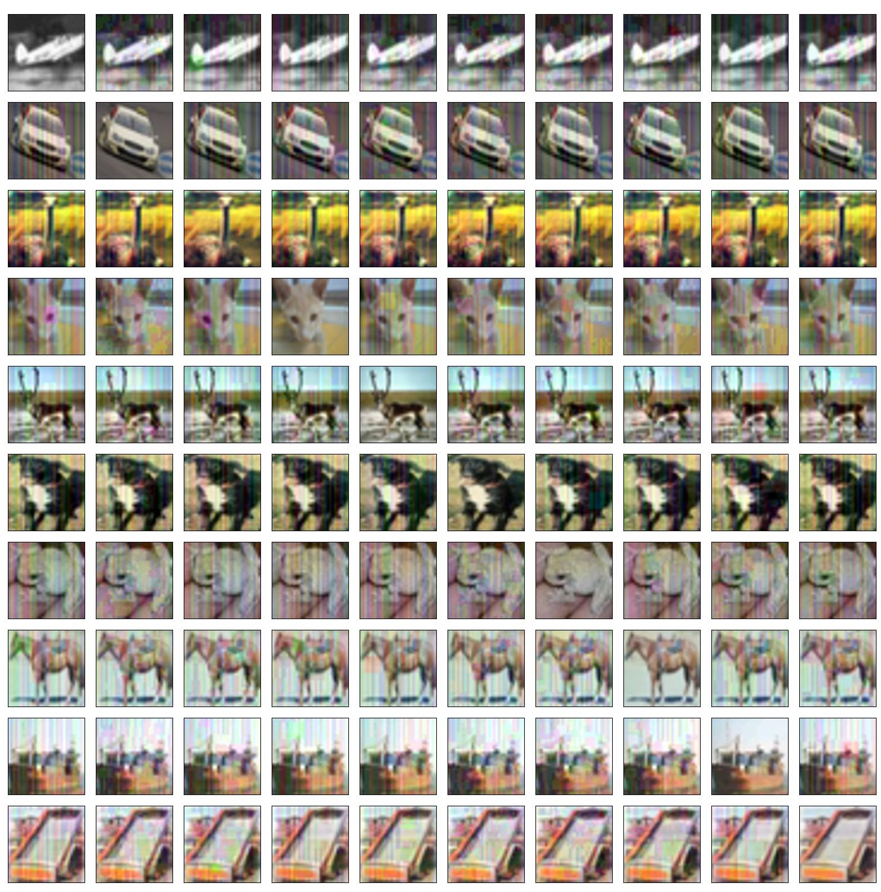

# Attackar: Attack of the Evolutionary Adversary

## This paper was submitted to IEEE Transactions on Evolutionary Computation, SI: Evolutionary Computer Vision

### Abstract:
Abstract—Deep neural networks (DNNs) are sensitive to adversarial data in a variety of scenarios,
including the black-box scenario, where the attacker is
only allowed to query the trained model and receive
an output. Existing black-box methods for creating
adversarial instances are costly, often using gradient
estimation or training a replacement network. This
paper introduces Attackar, an evolutionary, score-based,
black-box attack. Attackar is based on a novel objective
function that can be used in gradient-free optimization
problems. The attack only requires access to the output
logits of the classifier and is thus not affected by
gradient masking. No additional information is needed,
rendering our method more suitable to real-life situations. We test its performance with three different stateof-the-art models—Inception-v3, ResNet-50, and VGG16-BN—against three benchmark datasets: MNIST,
CIFAR10 and ImageNet. Furthermore, we evaluate
Attackar’s performance on non-differential transformation defenses and state-of-the-art robust models.
Our results demonstrate the superior performance of
Attackar, both in terms of accuracy score and query
efficiency.

## Prerequisites
1. python=3.8.12
2. pip install -r requirements.txt

## Download the trained models weights
2. Download models' weights from this link: [models weights](https://drive.google.com/file/d/1LKLicAXgL-Q9QFtvMWDkHN-8ESPBNjtO/view?usp=sharing)
3. Unzip it and place it in models/state_dicts/*.pt

## Run
- python main.py --model=<model_name> --dataset=<dataset_name> --eps=<epsilon> --pop=<pop_size> --gen=<n_gen> --images=<n_images> --tournament=<n_tournament>
- For MNIST dataset, run the above command with --model=custom
- For ImageNet dataset, change the IMAGENET_PATH global variable in ./data/datasets_loader.py file

